<div align="center">

# 


<br><br>


<br><br>

<a href="https://samiur-rahman-wasee.vercel.app"></a>
<a href="https://drive.google.com/file/d/1xp-ymC6ypvKL4Ju8sESD-JkNIyZjxT6T/view"></a>

</div>

<br>

```yaml
[~] ➤ whoami
Name:     Samiur Rahman Wasi
Location: CSE Dept. @ IIUC
Status:   Building Next.js architectures & exploring the latent space.
Focus:    [ "Full Stack Dev", "Federated Learning", "Deepfake Detection" ]
Ping:     samwaseee@gmail.com
```


<h3 align="center"> <p>My Tech Stack</p> </h3>
<div align="center">

<a href="https://www.cprogramming.com/"></a>
<a href="https://www.w3schools.com/cpp/"></a>
<a href="https://www.w3schools.com/css/"></a>
<a href="https://expressjs.com"></a>
<a href="https://firebase.google.com/"></a>
<a href="https://www.w3.org/html/"></a>
<a href="https://developer.mozilla.org/en-US/docs/Web/JavaScript"></a>
<a href="https://www.typescriptlang.org/"></a>
<a href="https://www.mongodb.com/"></a>
<a href="https://www.microsoft.com/en-us/sql-server"></a>
<a href="https://nodejs.org"></a>
<a href="https://reactjs.org/"></a>
<a href="https://tailwindcss.com/"></a>
<a href="https://nextjs.org/"></a>
<a href="https://dart.dev"></a>
<a href="https://flutter.dev"></a>
<a href="https://www.python.org/"></a>

</div>


<br><br>

<p align="center">
  <b>📊 My GitHub Stats</b>
</p>


<p align="center">
  
</p>

<p align="center">
  
</p>

<p align="center">
  
</p>

<p align="center">
  
</p>

<h5 align="center">🧑🏻‍💻 Coding Timeline </h5>
<h6 align="center">(still exploring different sites for security reasons)</h6>
<p align="center">
  
</p>
<h6 align="center"> 🗓️ Weekly Time </h6>
 <!--START_SECTION:waka-->

```txt
TypeScript   13 hrs 39 mins        █████████████████████▓░░░   86.12 %
Markdown     43 mins               █░░░░░░░░░░░░░░░░░░░░░░░░   04.59 %
Other        29 mins               ▓░░░░░░░░░░░░░░░░░░░░░░░░   03.06 %
JSON         21 mins               ▓░░░░░░░░░░░░░░░░░░░░░░░░   02.28 %
Bash         18 mins               ▒░░░░░░░░░░░░░░░░░░░░░░░░   01.93 %
```

<!--END_SECTION:waka-->

<h2 align="center">
    Connect with me
    <a>
        
    <a/>
</h2>
<p align="center">
    <a href="https://www.linkedin.com/in/samiur-rahman-wasi">
        
    </a>
    <a href="https://twitter.com/samwaseee">
        
    </a>
    <a title="samwaseee@gmail.com" href="mailto:samwaseee@gmail.com">
        
    </a>
    <a href="https://www.instagram.com/samiur_rahman_wasee">
        
    </a>
    <a href="https://www.facebook.com/Samiur.Rahman.Wasee">
        
    </a>
</p>
<br>
